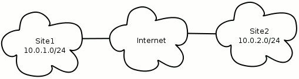
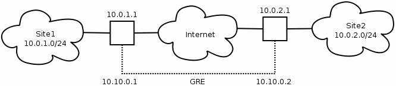

+++
title = "GRE Tunnel With Multicast Support"

[taxonomies]
tags = [
  "gre",
  "ip",
  "linux",
  "multicast",
  "network"
]
+++
Generic Routing Encapsulation (GRE) is a tunneling protocol developed by Cisco and is widely used for IP-to-IP tunneling. Since it can encapsulate all kinds of IP traffic, GRE can be used to transport multicast traffic over networks that have no multicast support.

Please note that Ubuntu Server was used as the basis for this article. Debian based Linux distributions will probably work with little to no modification, but other distributions might require more work or a different configuration.


## Configuration

*Tip:* On Linux the `ip_gre` module is needed. Add it to `/etc/modules` to load it at boot time.

Consider a scenario where we have two networks, `Site1` and `Site2`, and both are connected to the internet. The network owners want to send multicast traffic between the two networks, which is not supported by the network between them.



The site networks have the following configuration:

```
Site1
network 10.0.1.0
netmask 255.255.255.0
router  10.0.1.1

Site2
network 10.0.2.0
netmask 255.255.255.0
router  10.0.2.1
```

The routers are assumed to be Linux boxes with a GRE tunnel configuration on each one. Tunnel devices are created using the ip command. These network devices behave as network interfaces. The following commands will create the tunnel interface for `Site1`:

```
ip tunnel add gre-site2 mode gre remote 10.0.2.1 local 10.0.1.1 ttl 255
ip link set gre-site2 up
ip link set gre-site2 multicast on
ip addr add 10.10.0.1/30 broadcast 10.10.0.3 dev gre-site2
```

*Tip:* The `ip` command is found in the `iproute` (or `iproute2`) package.

The first command line creates the tunnel interface. A tunnel is defined by its endpoints, so we have a remote (destination) IP address and a local (source) IP address. The TTL is set to maximum since we don't know the structure of the underlying network used by the tunnel.

Command lines two and three brings the interface up to an active state and enables multicast on it. Your multicasting routing daemon of choice might not automatically be aware of new multicast capable interfaces, so remember to do any necessary actions or configuration changes to make it register the new interface.

Command line four adds an IP address to the GRE interface so that we can address it as part of our network. We have chosen a `/30` network since a tunnel only needs two IP adresses.

`Site2` is configured the same way:

```
ip tunnel add gre-site1 mode gre remote 10.0.1.1 local 10.0.2.1 ttl 255
ip link set gre-site1 up
ip link set gre-site1 multicast on
ip addr add 10.10.0.2/30 broadcast 10.10.0.3 dev gre-site1
```

The tunnel should now be functional. Try to ping the endpoint addresses from the routers. If there is no contact, see if the routing table contains the correct entry for the `10.10.0.0/30` network.



To get traffic through the tunnel you must define a route to the appropriate network. To get traffic from `Site1` to `Site2`, `Site1` must know that the `Site2` network is accessed through the tunnel:

```
ip route add 10.0.2.0/24 via 10.10.0.2
```

This makes all packets destined for the `Site2` network `10.0.2.0/24` be routed to the other end of the tunnel (`10.10.0.2` as seen from `Site1`). If all traffic is supposed to go there just replace the default route:

```
ip route replace default via 10.10.0.2
```

`Site2` will of course need a similar configuration for packets to get to the `Site1` network.


## Adjusting MSS

Since a GRE packet reserves some space for its header, the total amount of space available for the payload is less than the typical maximum TCP packet size. Consequently, if PMTUD fails then packets that can't be fragmented will not get through the tunnel. A typical symptom of this happening is when web browsing over the tunnel fails but some other types of traffic works (like ping with small packets). One solution to this is to clamp MSS to PMTU using iptables, ensuring that all packets stay below the tunnel packet size limit. Let's do this on `Site2` in our scenario:

```
iptables -t mangle -A POSTROUTING -p tcp --tcp-flags SYN,RST SYN \
         -o gre-site1 -j TCPMSS --clamp-mss-to-pmtu
```

Let's take a look at the options.

```
-t mangle
    Indicates we are using the mangle table to alter a packet in some way.

-A POSTROUTING
    Means the mangling is done after the routing stage. We only want to
    affect packets going to a specific interface.

-p tcp
    Defines which protocol to look for.

--tcp-flags
    Sets the TCP flags to look for, and which of them have to be set.

-o gre-site1
    Sets the output interface for the packet.

-j TCPMSS
    Defines which iptable target to jump to if the packet matches. TCPMSS
    allows us to alter the MSS value of TCP SYN packets (see iptables man
    page for details).

--clamp-mss-to-pmtu
    Tells iptables to automatically set the new MSS to PMTU - 40.
```


## Network Scripts

Everything done so far in our scenario has been done manually. Typing all of it every time the server reboots or an interface goes down is out of the question, so it's time to look at how we can automate it. There are many ways that can be done, but the following is the author's preference and should serve well as an example.

A GRE tunnel is clearly dependent on another network interface to exist, either physical or virtual. This tells us the configuration should be tied to the interface the tunnel uses, and using custom network interface scripts lets us make that connection. Assuming the `Site1` router uses `eth1` to connect to the internet, we can configure `/etc/network/interfaces` like this:

```
iface eth1 inet static
  address 10.0.1.1
  netmask 255.255.255.0
  network 10.0.1.0
  broadcast 10.0.1.255
  post-up /etc/network/custom/eth1-post-up
  pre-down /etc/network/custom/eth1-pre-down
```

Now we must create the `/etc/network/custom` directory and put in it the file `eth1-post-up` containing something like this:

```bash
# eth1 post-up dependencies

IPCMD="/sbin/ip"
IPTABLES="/sbin/iptables"

# GRE tunnel to Site2
GREINT="gre-site2"
$IPCMD tunnel add $GREINT mode gre remote 10.0.2.1 local 10.0.1.1 ttl 255
$IPCMD link set $GREINT up
$IPCMD link set $GREINT multicast on
$IPCMD addr add 10.10.0.1/30 broadcast 10.10.0.3 dev $GREINT

# Make sure the right MTU is used through the tunnel
$IPTABLES -t mangle -A POSTROUTING -p tcp --tcp-flags SYN,RST SYN \
  -o $GREINT -j TCPMSS --clamp-mss-to-pmtu

# Add a route to the Site2 network
$IPCMD route add 10.0.2.0/24 via 10.10.0.2
```

The `eth1-pre-down` file acts as a cleanup script for when `eth1` is taken down:

```bash
# eth1 pre-down dependencies

IPCMD="/sbin/ip"
IPTABLES="/sbin/iptables"

GREINT="gre-site2"

# Clean up iptables MTU correction for GRE tunnel
$IPTABLES -t mangle -D POSTROUTING -p tcp --tcp-flags SYN,RST SYN \
  -o $GREINT -j TCPMSS --clamp-mss-to-pmtu

# Take down GRE tunnel
$IPCMD link set $GREINT down
$IPCMD tunnel del $GREINT
```

Create similar scripts on `Site2`'s router and you're all set.


## References

[Linux Advanced Routing & Traffic Control](https://web.archive.org/web/20180129185606/http://lartc.org/howto/lartc.tunnel.gre.html)

[Generic Routing Encapsulation on Wikipedia](http://en.wikipedia.org/wiki/Generic_Routing_Encapsulation)

[Guide to IP Layer Network Administration with Linux](http://linux-ip.net/)

[iproute2](http://www.linuxfoundation.org/en/Net:Iproute2)
