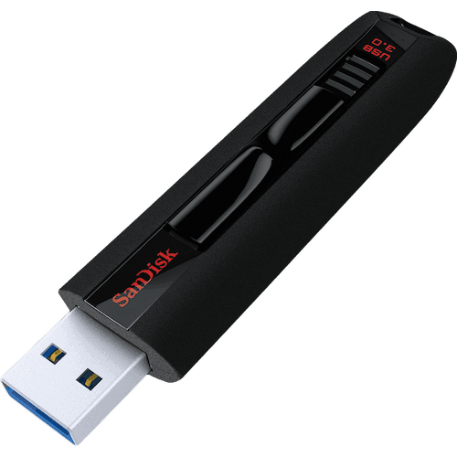
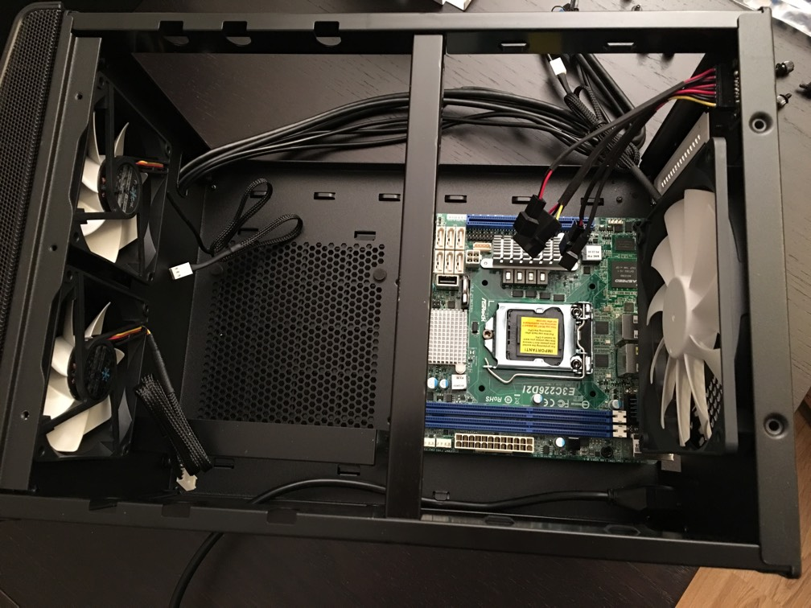
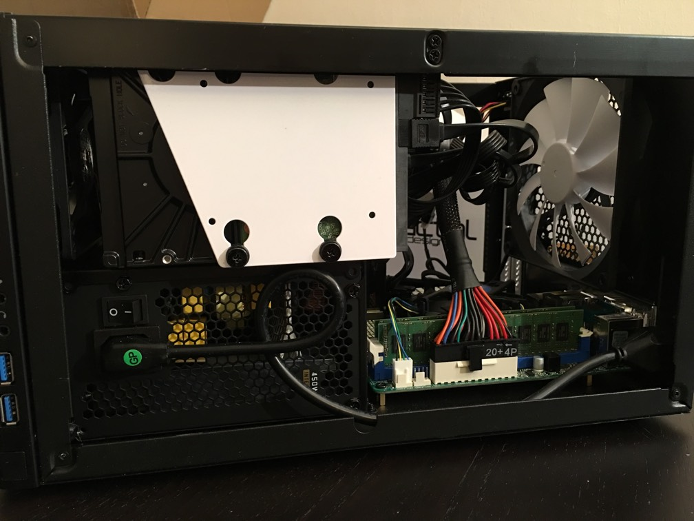

+++
title = "DIY NAS"
+++
# DIY NAS

The time has come to retire my [Synology](http://synology.com) DS411slim NAS.

It is an excellent NAS box, tiny and silent and has plenty of features, but I find myself wanting more power, storage space and increased data safety.

The more power requirement stems from a desire to run [Plex Media Server](https://plex.tv) on the NAS, with enough power to transcode at least one stream in realtime from a 1080p source.

Storage space has lately become an issue. The DS411slim has 4 2.5" drive bays, and max capacity of such drives are currently 2 TB which is far behind 3.5" drives. I want to put all my media on the NAS; DVDs, Blu-Rays, CDs, Photos and movie clips, in addition to TimeMachine backups and various files and disc images. I have calculated my storage requirements to be about 6 TB, a far cry from my current capacity which is 2 TB (4x1 TB in RAID10).

Extra data safety and ensured data integrity is necessary with large storage capacities. I don't want a stray cosmic ray or faulty hardware to mangle my files. Using ECC memory, disk mirroring and a self-healing file system like ZFS or Btrfs should be safe enough.

Of course, any storage solution requires an off-site backup to be truly safe, and for that I'm already using [Jottacloud](http://jottacloud.com).

As the title implies I've decided to build my own NAS this time. Why not go with a Synology NAS once more? They have begun rolling out models with Btrfs support after all. I would recommend those models to anyone who wants a NAS that is easy to configure and use, but they don't fulfill all my requirements: Not powerful enough for Plex transcoding of 1080p source material, no ECC memory, limited memory, limited expandability without external enclosures, and adding software unsupported by Synology is difficult.

My first thought was to just do a regular server install using either Linux with Btrfs or FreeBSD with ZFS. That would work just fine and give me maximum flexibility. However, configuring and maintaining the base software installation of a server is time consuming and sometimes difficult, so I want to avoid that.

[FreeNAS](http://www.freenas.org), based on [FreeBSD](http://www.freebsd.org), solves that problem. The base system comes preconfigured for NAS use and is easy to update. It uses ZFS for storage, and has a useful (but somewhat confusing) administration web GUI. There is a Plex plug-in that is actively kept up to date, and I can install additional software in jails.

FreeNAS is useless without hardware, so let's have a look at the PC components I have selected.

## Components

**Case: [Fractal Design Node 304](http://www.fractal-design.com/home/product/cases/node-series/node-304-black)**

Small, silent, good looking and has 6 3,5" drive bays. With todays drive capacities that should last a while. Despite the small size it has room for a full-sized ATX PSU.

**PSU: [Fractal Design Integra M 450W](http://www.fractal-design.com/home/product/power-supplies/integra-m/integra-m-450w)**

Since this will be a low-power mini-ITX build it will have very modest power requirements. It's more important that the PSU is stable, efficient and silent. This PSU is modular, which is a bonus when trying to fit everything in a small case.

**Motherboard: [ASRock E3C226D2I](http://www.asrockrack.com/general/productdetail.asp?Model=E3C226D2I#Specifications)**

This board has everything I need: ECC RAM support, 6 SATA3 ports, USB 3, Intel NICs, and is compatible with Intel Core i3 T-series CPUs. I thought about going for a bleeding edge Intel Skylake compatible motherboard, but for the time being finding one with the required specifications isn't easy. I don't really need the slight boost in performance and there are benefits with technology that is a generation or two behind. Hardware bugs have likely been found and fixed in newer revisions and firmwares, and drivers have been updated and optimized. The price is also lower.

**CPU: [Intel Core i3 4130T](http://ark.intel.com/products/77481/Intel-Core-i3-4130T-Processor-3M-Cache-2_90-GHz)**

A Core i3 has more than enough power for a NAS, but most important of all the Haswell (and newer) i3 CPUs share a feature with Xeons: ECC RAM support. This is a T-series model with a TDP of only 35W. Less heat means less need for cooling which means less noise. Will this CPU be enough to transcode 1080p Blu-Ray source material? According to benchmarks it should be. We'll see.

**Memory: [Kingston ValueRAM Server Premier 8GB 1600MHz DDR3 ECC](http://www.kingston.com/dataSheets/KVR16E11_8HB.pdf)**

Not much to say. Cheap unbuffered ECC RAM targeted for server use. The motherboard only supports 16 GB max, so I bought two. For a NAS RAM is important, especially when using ZFS. Always buy as much RAM as you can afford (within reason).

**USB flash drive: [SanDisk Extreme Pro 16GB USB 3.0](https://www.sandisk.com/home/usb-flash/extreme-usb)**

FreeNAS is usually installed to and run from a USB flash drive. I opted for one with high read/write speeds, but have no idea what kind of longevity I can expect from it. The system drive isn't a critical component in this build, so if it breaks it's easy and quick to do a new FreeNAS install on another flash drive and import the previous configuration.

**HDD: [Western Digital Red SOHO NAS 6 TB](http://www.wdc.com/en/products/products.aspx?id=810)**

My planned drive configuration is to use a zpool of mirrors. I ordered 4x6 TB for now and can add one more mirror to the pool when I need more space. When all drive bays are full I can upgrade the mirrors with larger capacity drives. Upgrading this way is not optimal for performance, but it is flexible, has a low up-front cost, and for my use case it should suffice.

## The Build

Exciting!

The Node 304 is a good looking case that can easily be placed in the living room. The fans are quiet and the case comes with a built-in fan voltage regulator. I have noticed that the smaller front fans have trouble starting if the system is powered on with the regulator set to 5V, so I always use 12V when powering on, and then adjust the voltage down.

It'll be a tight fit, but there should be room for everything and still have good airflow.

No problem fitting the motherboard. Remember to mount the backplate first, or you'll have to remove the motherboard to mount it (yes, I forgot to do that).

PSU fits nicely too. The case supports full-size ATX PSUs, but it will be a tight fith with the bigger ones, especially of the non-modular variety.

One disk pair mounted. Cables need cleanup.

Voila! Here is the result. As you can see getting the cables out of the way is a challenge in such a small case, but doable. The SATA and HDD power cables are bunted together behind the drive bays. The rest are run along the side to the PSU area. It looks a bit messy on the images, but there is plenty of room above the motherboard and airflow is good.

## Testing and Results

Testing the hardware before use is essential, but I'm not going to write about that since Jeff Atwood over at [Coding Horror](http://blog.codinghorror.com/) recently wrote [an article](http://blog.codinghorror.com/is-your-computer-stable/) about it. Read it and do it.

The performance of this build has exceeded my expectations. With FreeNAS I consistently get 800-900 Mbit/s read and write speeds on a CIFS (SMB) share, compared to half that with the DS411slim. Plex transcoding works fine even on Blu-Ray source material, and the whole system feels very snappy and responsive. I would have saved a lot of time just buying another Synology NAS, but I'm more than satisfied with the result. I can highly recommend building your own NAS if you're willing to do the required research.
